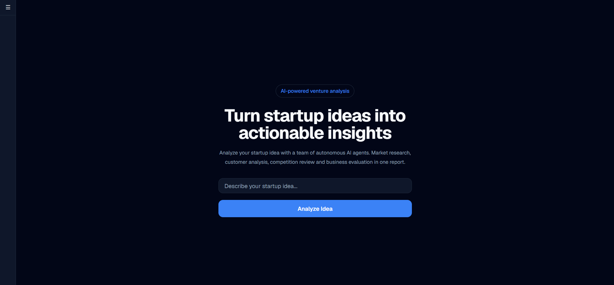
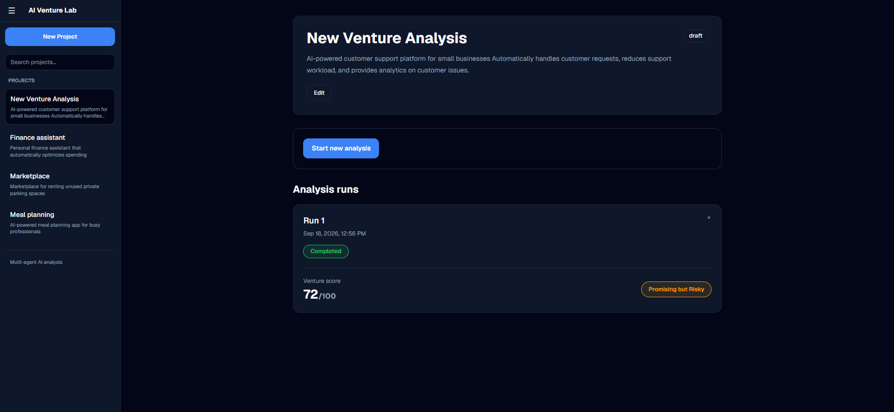
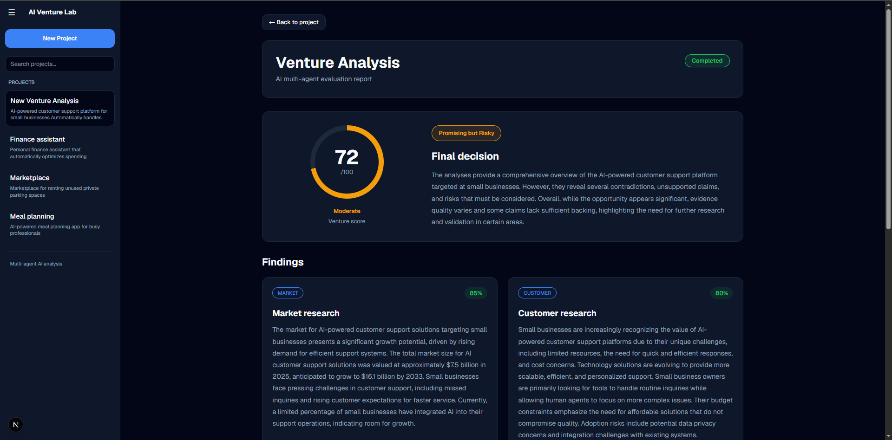
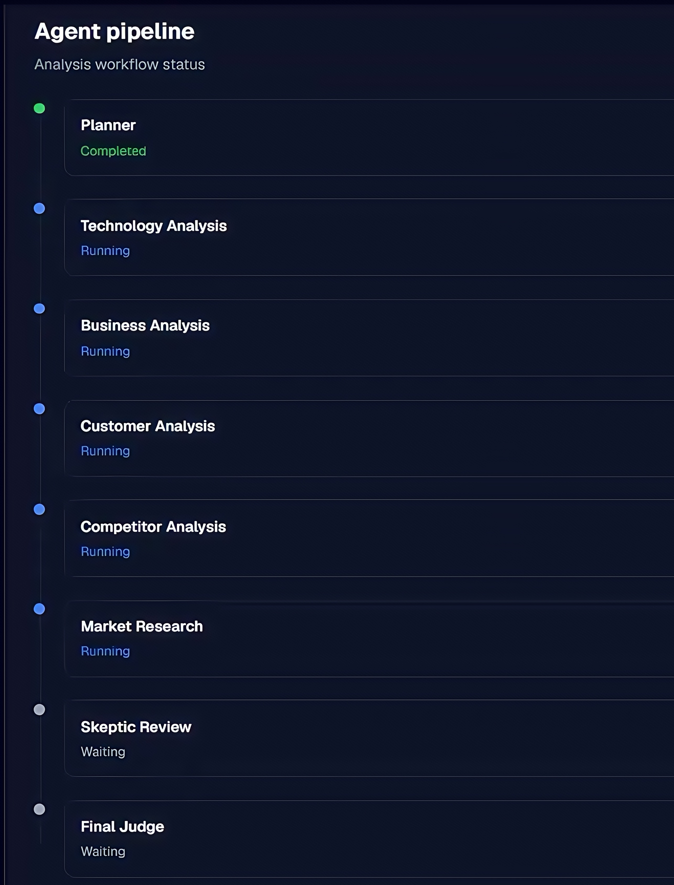

# AI Venture Lab

AI Venture Lab is a multi-agent platform for evaluating startup ideas using LLM-powered analysis workflows.

The system takes a startup idea, runs it through a structured analysis pipeline, collects research data, and produces an evaluation report with findings, risks, and opportunity assessment.

---
## UI

### Dashboard



### Project page


### Run page



### Agent pipeline


## Technology Stack

### Backend:

* Python 3.12
* FastAPI 0.141
* SQLAlchemy 2.0 (Async) 
* PostgreSQL 16
* Alembic 1.20
* Redis 7
* LangGraph 1.x
* Langfuse 4.x
* Tavily Python SDK 0.7
* Pydantic 2.13
* Ruff 0.13
* Pytest 9.1

### Frontend:

* Next.js 16.3.5
* React 19.2.8
* TypeScript
* Tailwind CSS

### Infrastructure

* Docker
* Docker Compose
* GitHub Actions CI

### AI / Research

* LLM API integration
* Multi-agent workflows
* LangGraph orchestration
* Web search integration
* Langfuse observability
* OpenTelemetry tracing

---

## Backend

Navigate to backend directory:

```bash
cd backend
```

Install dependencies:

```bash
uv sync
```

Run backend:

```bash
uv run uvicorn app.main:app --reload
```

Run migrations:

```bash
uv run alembic upgrade head
```

Run tests:

```bash
uv run pytest
```

Run code quality checks:

```bash
uv run ruff check .
```

---

## Frontend

Navigate to frontend directory:

```bash
cd frontend
```

Install dependencies:

```bash
npm install
```

Run development server:

```bash
npm run dev
```

Build production version:

```bash
npm run build
```

---

## Docker Development

Create environment file:

```bash
cp .env.example .env
```

Start all services:

```bash
docker compose up --build
```

---

## Services

| Service     | URL                        |
| ----------- | -------------------------- |
| Frontend    | http://localhost:3000      |
| Backend API | http://localhost:8000      |
| Swagger     | http://localhost:8000/docs |
| PostgreSQL  | localhost:5432             |
| Redis       | localhost:6379             |

---

## Database

The project uses PostgreSQL with SQLAlchemy async models.

Database changes are managed through Alembic migrations.

Create migration:

```bash
uv run alembic revision --autogenerate -m "migration_name"
```

Apply migrations:

```bash
uv run alembic upgrade head
```

---

## Testing

Backend tests run with:

```bash
uv run pytest
```

The CI pipeline automatically:

* starts PostgreSQL
* starts Redis
* installs dependencies with uv
* runs tests
* checks code quality with Ruff

---

## CI/CD

GitHub Actions workflows validate every pull request and push to protected branches.

Current checks:

### Backend

* Dependency installation
* Ruff linting
* Pytest test suite

### Frontend

* npm install
* ESLint
* Next.js production build

---

## Environment Variables

### Backend:

```
POSTGRES_HOST=127.0.0.1
POSTGRES_PORT=15432
POSTGRES_DB=venture_lab
POSTGRES_USER=postgres
POSTGRES_PASSWORD=postgres

REDIS_HOST=127.0.0.1
REDIS_PORT=6379

OPENAI_API_KEY=your_openai_key
OPENAI_MODEL=gpt-4o-mini

TAVILY_API_KEY=your_tavily_key

LANGFUSE_PUBLIC_KEY=your_langfuse_public_key
LANGFUSE_SECRET_KEY=your_langfuse_secret_key
LANGFUSE_BASE_URL=https://cloud.langfuse.com
LANGFUSE_TRACING_ENVIRONMENT=development
```

### Frontend:

```
INTERNAL_API_URL=http://backend:8000/api/v1
NEXT_PUBLIC_API_URL=http://localhost:8000/api/v1
```
